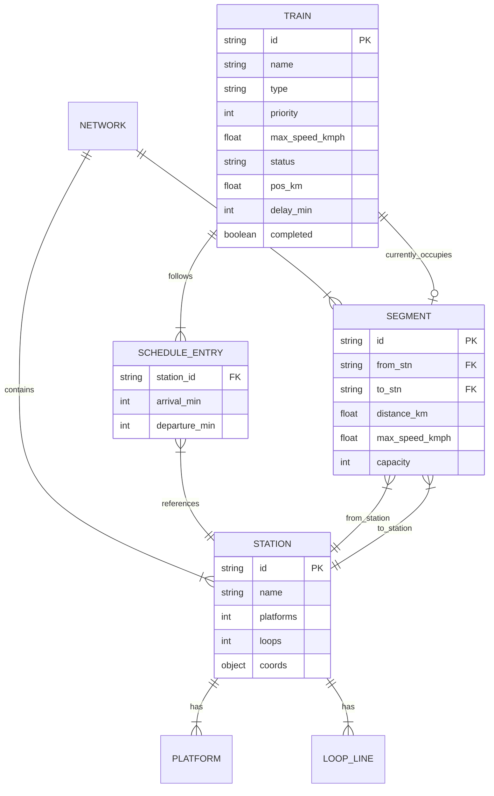

# Data Models & Schema Reference

This document outlines the data schemas, entity relationships, and JSON models used across the **Project Aahavaan** ecosystem.

---

## 🗄️ Entity-Relationship Diagram



---

## 📄 JSON Schema Definitions

### 1. Network Topology Schema (`network.json`)
```json
{
  "$schema": "http://json-schema.org/draft-07/schema#",
  "title": "RailwayNetwork",
  "type": "object",
  "properties": {
    "stations": {
      "type": "array",
      "items": {
        "type": "object",
        "properties": {
          "id": { "type": "string", "example": "STN_00" },
          "name": { "type": "string", "example": "Station A" },
          "coords": {
            "type": "object",
            "properties": {
              "x": { "type": "number" },
              "y": { "type": "number" }
            },
            "required": ["x", "y"]
          },
          "platforms": { "type": "integer", "default": 1 },
          "loops": { "type": "integer", "default": 2 }
        },
        "required": ["id", "name", "coords", "platforms", "loops"]
      }
    },
    "segments": {
      "type": "array",
      "items": {
        "type": "object",
        "properties": {
          "id": { "type": "string", "example": "SEG_01" },
          "from_stn": { "type": "string", "example": "STN_00" },
          "to_stn": { "type": "string", "example": "STN_01" },
          "distance_km": { "type": "number", "example": 15.0 },
          "max_speed_kmph": { "type": "number", "example": 130 },
          "capacity": { "type": "integer", "default": 1 }
        },
        "required": ["id", "from_stn", "to_stn", "distance_km", "max_speed_kmph", "capacity"]
      }
    }
  },
  "required": ["stations", "segments"]
}
```

---

### 2. Train Timetable Schema (`timetable.json`)
```json
{
  "$schema": "http://json-schema.org/draft-07/schema#",
  "title": "TrainTimetable",
  "type": "object",
  "properties": {
    "trains": {
      "type": "array",
      "items": {
        "type": "object",
        "properties": {
          "id": { "type": "string", "example": "T_12301" },
          "name": { "type": "string", "example": "Vande Bharat 1" },
          "type": { "type": "string", "enum": ["Vande Bharat", "Rajdhani", "Freight"] },
          "priority": { "type": "integer", "minimum": 1, "maximum": 10 },
          "max_speed_kmph": { "type": "number", "example": 160 },
          "schedule": {
            "type": "array",
            "items": {
              "type": "object",
              "properties": {
                "station_id": { "type": "string" },
                "arrival_min": { "type": "integer" },
                "departure_min": { "type": "integer" }
              },
              "required": ["station_id", "arrival_min", "departure_min"]
            }
          }
        },
        "required": ["id", "name", "type", "priority", "max_speed_kmph", "schedule"]
      }
    }
  },
  "required": ["trains"]
}
```

---

### 3. Simulation Live State Model (Python Pydantic Representation)
```python
from pydantic import BaseModel
from typing import List, Optional

class ScheduleItem(BaseModel):
    station_id: str
    arrival_min: int
    departure_min: int

class TrainTelemetry(BaseModel):
    id: str
    name: str
    type: str
    priority: int
    status: str # "WAITING" | "MOVING" | "ARRIVED" | "COMPLETED"
    current_stn: Optional[str]
    next_stn: Optional[str]
    pos_km: float
    speed_kmph: float
    delay_min: int
    completed: bool
    schedule: List[ScheduleItem]

class SystemTelemetryState(BaseModel):
    current_time: int
    trains: List[TrainTelemetry]
```
