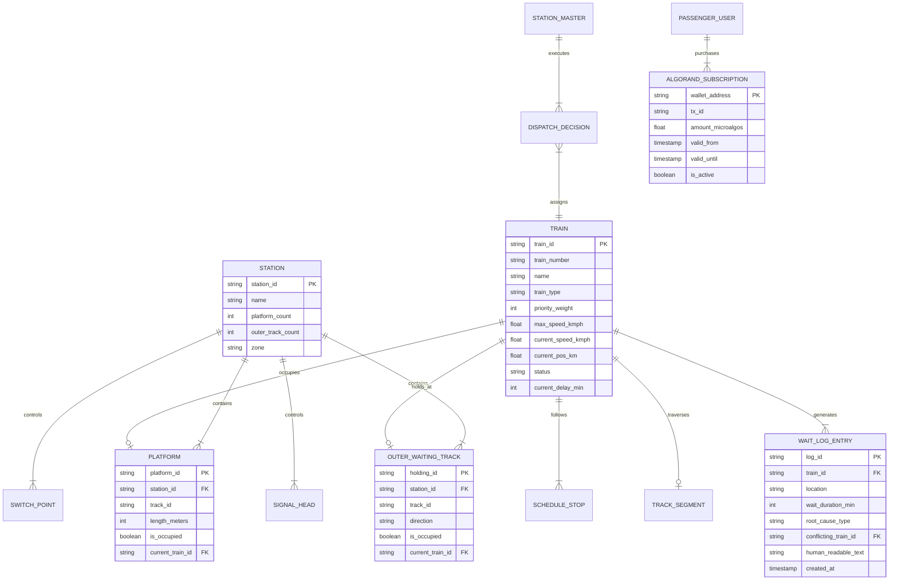

# Data Models, Real-Time Telemetry & Database Schemas (`docs/database_schema.md`)

This document defines the complete schema specifications for **Real-Time Simulation Telemetry**, **Historical & Synthetic Datasets**, **Relational Database Tables**, and **API Payload Models** for **Project Aahavaan - Rail**.

---

## 🗄️ 1. Complete Entity-Relationship Diagram (ERD)



---

## ⚡ 2. Real-Time Telemetry Data Structures

### 2.1 Live Train Physics & Kinematic State
Represents the live physical telemetry broadcast every 500ms or 60Hz over WebSocket `/ws/simulator` and `/ws/station-master`:

```typescript
interface TrainRealTimeTelemetry {
  train_id: string;               // e.g. "T_12301"
  train_number: string;           // e.g. "12301"
  name: string;                   // e.g. "New Delhi Rajdhani Express"
  type: "Vande Bharat" | "Rajdhani" | "Freight";
  priority_weight: number;        // 10 (Vande Bharat), 8 (Rajdhani), 2 (Freight)
  
  // Spatial & Kinematics
  current_block_id: string;       // e.g. "SEG_02_03" or "TRK_P2" or "TRK_OH1"
  sub_block_pos_meters: number;   // Distance traversed within current block (meters)
  total_route_km: number;         // Continuous corridor position (km)
  speed_kmph: number;             // Instantaneous velocity (0 to 160 km/h)
  acceleration_mps2: number;      // Acceleration/deceleration rate (m/s²)
  
  // Status State Machine
  status: "IN_TRANSIT" | "WAITING_OUTER" | "DWELLING_PLATFORM" | "TERMINATED";
  dwell_time_remaining_sec: number; // Seconds left at platform before departure
  
  // Punctuality
  scheduled_eta_min: number;
  current_delay_min: number;      // Deviation against published timetable
  
  // Route Lock
  assigned_platform_id: string | null; // e.g. "PLATFORM_2"
  assigned_holding_id: string | null;  // e.g. "OUTER_HOLD_1"
}
```

### 2.2 6-Platform Junction Physical Layout State
```typescript
interface StationPhysicalState {
  station_id: "STN_JUNCTION_01";
  name: "Aahavaan Central Junction";
  
  // 6 Dedicated Platform Tracks
  platforms: Array<{
    platform_id: "PLATFORM_1" | "PLATFORM_2" | "PLATFORM_3" | "PLATFORM_4" | "PLATFORM_5" | "PLATFORM_6";
    track_id: string;
    is_occupied: boolean;
    occupant_train_id: string | null;
    platform_length_meters: number;
    platform_type: "HIGH_LEVEL_ISLAND" | "PASSENGER_TERMINAL";
  }>;
  
  // 4 Outer Waiting Tracks / Holding Sidings (Prior to Home Signal)
  outer_waiting_tracks: Array<{
    holding_id: "OUTER_HOLD_1" | "OUTER_HOLD_2" | "OUTER_HOLD_3" | "OUTER_HOLD_4";
    track_id: string;
    is_occupied: boolean;
    occupant_train_id: string | null;
    direction: "UP_MAIN" | "DOWN_MAIN";
    max_holding_capacity: 1;
  }>;
  
  // Switch Turnout Points
  switches: Array<{
    switch_id: string;            // e.g. "SW_01A"
    alignment: "NORMAL" | "REVERSE";
    locked_for_route_id: string | null;
    is_in_transit: boolean;
  }>;
  
  // Dynamic 4-Aspect Signals
  signals: Array<{
    signal_id: string;            // e.g. "SIG_HOME_UP"
    aspect: "RED" | "YELLOW" | "DOUBLE_YELLOW" | "GREEN";
    protecting_block_id: string;
    interlocking_locked: boolean;
  }>;
}
```

### 2.3 Station Master AI Recommendation Tuple
The exact data structure output by the CP-SAT solver and delivered to the Station Commander radar:

```typescript
interface StationMasterRecommendation {
  recommendation_id: string;      // Unique UUID, e.g. "REC_9021"
  timestamp: number;              // Simulation minute
  train_id: string;               // e.g. "T_12301"
  train_name: string;
  train_type: string;
  priority: number;
  eta_minutes: number;
  
  // Optimization Outputs
  recommended_track: "PLATFORM_1" | "PLATFORM_2" | "PLATFORM_3" | "PLATFORM_4" | "PLATFORM_5" | "PLATFORM_6" | "OUTER_HOLD_1" | "OUTER_HOLD_2" | "OUTER_HOLD_3" | "OUTER_HOLD_4";
  recommended_action: "ROUTE_TO_PLATFORM" | "DIVERT_TO_OUTER_HOLDING";
  outer_wait_duration_min: number; // 0 if direct platform entry
  
  // Explainable Decision Rationale
  reasoning: string;              // "Platform 2 clear. Prevents holding Rajdhani behind freight."
  estimated_delay_saved_min: number;
  
  // Safety Verification Flag
  safety_interlock_approved: boolean; // Must be true before button enabled
  status: "PENDING_APPROVAL" | "APPROVED" | "OVERRIDDEN" | "EXPIRED";
}
```

---

## 📊 3. Dataset Schemas (Historical, Synthetic & Training)

### 3.1 Raw Indian Railways Timetable (`models/datasets/raw/ir_timetables_raw.csv`)
| Column | Type | Example | Description |
| :--- | :--- | :--- | :--- |
| `train_no` | string | `"12301"` | Official 5-digit Indian Railways train number. |
| `train_name` | string | `"Howrah Rajdhani"` | Official train service name. |
| `station_code` | string | `"NDLS"` | 3-4 letter IR station code. |
| `seq_id` | integer | `1` | Route sequence stop index. |
| `arr_time` | string | `"16:55"` | Published arrival time (`HH:MM`). |
| `dep_time` | string | `"17:05"` | Published departure time (`HH:MM`). |
| `distance_km` | float | `0.0` | Cumulative route distance from origin. |
| `train_type` | string | `"Rajdhani"` | Service class (Vande Bharat, Rajdhani, Mail/Exp, Freight). |

### 3.2 Normalized Feature Matrix for Delay Predictor (`models/datasets/processed/`)
Format: Apache Parquet / Pandas DataFrame:

```python
{
    "train_priority": int,        # 1 to 10
    "scheduled_dwell_min": float, # e.g. 5.0
    "preceding_headway_min": float,# Spacing from previous train on same block
    "section_length_km": float,   # Segment distance (e.g. 15.0 km)
    "max_section_speed": float,   # Section MPS (110 or 130 km/h)
    "current_delay_min": float,   # Delay accumulated so far
    "weather_visibility_factor": float, # 1.0 (clear) to 0.4 (dense fog)
    "is_junction_approach": bool, # True if approaching 6-platform junction
    "target_delay_deviation": float # Label: actual delay deviation at next stop
}
```

---

## 💾 4. Relational Database Schema (SQLite / PostgreSQL)

Used by `backend/app/payments/subscription_db.py` and operational audit trails:

### Table: `subscriptions`
```sql
CREATE TABLE subscriptions (
    wallet_address VARCHAR(58) PRIMARY KEY,
    tx_id VARCHAR(64) NOT NULL UNIQUE,
    amount_microalgos BIGINT NOT NULL,
    payment_network VARCHAR(20) DEFAULT 'algorand-testnet',
    created_at TIMESTAMP DEFAULT CURRENT_TIMESTAMP,
    expires_at TIMESTAMP NOT NULL,
    is_active BOOLEAN DEFAULT TRUE
);

CREATE INDEX idx_sub_expires ON subscriptions(expires_at);
```

### Table: `station_master_audit_log`
```sql
CREATE TABLE station_master_audit_log (
    audit_id VARCHAR(36) PRIMARY KEY,
    recommendation_id VARCHAR(36) NOT NULL,
    train_id VARCHAR(20) NOT NULL,
    recommended_track VARCHAR(20) NOT NULL,
    actual_assigned_track VARCHAR(20) NOT NULL,
    action_type VARCHAR(20) NOT NULL, -- 'APPROVED' | 'OVERRIDDEN' | 'EMERGENCY_STOP'
    dispatcher_id VARCHAR(50) NOT NULL,
    safety_check_passed BOOLEAN NOT NULL,
    timestamp TIMESTAMP DEFAULT CURRENT_TIMESTAMP
);
```

### Table: `passenger_wait_logs`
```sql
CREATE TABLE passenger_wait_logs (
    log_id VARCHAR(36) PRIMARY KEY,
    train_id VARCHAR(20) NOT NULL,
    station_or_outer_block VARCHAR(50) NOT NULL,
    started_at_min INT NOT NULL,
    cleared_at_min INT,
    conflicting_train_id VARCHAR(20),
    plain_english_reason TEXT NOT NULL,
    created_at TIMESTAMP DEFAULT CURRENT_TIMESTAMP
);

CREATE INDEX idx_wait_train ON passenger_wait_logs(train_id);
```

---

## 🍃 5. MongoDB Document Database Schemas (`database/`)

The application stores user credentials, authentication tokens, active subscriptions, and operational logs in MongoDB (`aahavaan_rail` database), managed via the root `database/` package.

### Architecture & Collections:
- `database/__init__.py`: Initializes MongoDB client and exports collection models.
- `database/users.py`: User accounts, bcrypt passwords, and `is_premium` status.
- `database/subscriptions.py`: Active ₹9 subscription passes and transaction proofs.
- `database/audit_logs.py`: Station Master approval and override audit log collection.
- `database/wait_logs.py`: Passenger explainability logs and conflict history.

### 5.1 Collection: `users`
```json
{
  "_id": "ObjectId('66e4a28f42d1b821...')",
  "username": "rajesh_commuter",
  "email": "rajesh@example.com",
  "hashed_password": "$2b$12$e8x...",
  "full_name": "Rajesh Kumar",
  "wallet_address": "ALGORAND_TESTNET_WALLET_ADDRESS",
  "is_premium": true,
  "created_at": "2026-09-13T10:30:00Z",
  "updated_at": "2026-09-13T10:32:00Z"
}
```
**Indexes**:
- `username`: Unique Ascending
- `email`: Unique Ascending

### 5.2 Collection: `subscriptions`
```json
{
  "_id": "ObjectId('66e4a28f42d1b822...')",
  "wallet_address": "ALGORAND_TESTNET_WALLET_ADDRESS",
  "tx_id": "W7X3K6Y2ABCXYZ1234567890TESTNETALGORANDTRANSACTIONHASH",
  "amount_microalgos": 100000,
  "payment_network": "algorand-testnet",
  "username": "rajesh_commuter",
  "is_active": true,
  "created_at": "2026-09-13T10:30:00Z",
  "expires_at": "2026-10-13T10:30:00Z"
}
```
**Indexes**:
- `wallet_address`: Ascending
- `tx_id`: Unique Sparse

### 5.3 Collection: `station_master_audit_log`
```json
{
  "_id": "ObjectId('66e4a28f42d1b823...')",
  "audit_id": "3f8b0e8c-5d9a-4e8b-b1a9-9c5e8f4a1b2c",
  "recommendation_id": "REC_8841",
  "train_id": "T_12301",
  "recommended_track": "PLATFORM_2",
  "actual_assigned_track": "PLATFORM_1",
  "action_type": "APPROVED_AND_LOCKED",
  "dispatcher_id": "SM_OFFICER_04",
  "safety_check_passed": true,
  "timestamp": "2026-09-13T10:31:00Z"
}
```

### 5.4 Collection: `passenger_wait_logs`
```json
{
  "_id": "ObjectId('66e4a28f42d1b824...')",
  "log_id": "a1b2c3d4-e5f6-7a8b-9c0d-1e2f3a4b5c6d",
  "train_id": "T_12301",
  "station_or_outer_block": "Outer Holding Track 1 (Before Junction)",
  "started_at_min": 137,
  "cleared_at_min": 145,
  "conflicting_train_id": "T_20901",
  "plain_english_reason": "Your train is currently held at Outer Holding Track 1 to grant precedence to Vande Bharat Express...",
  "created_at": "2026-09-13T10:32:00Z"
}
```
