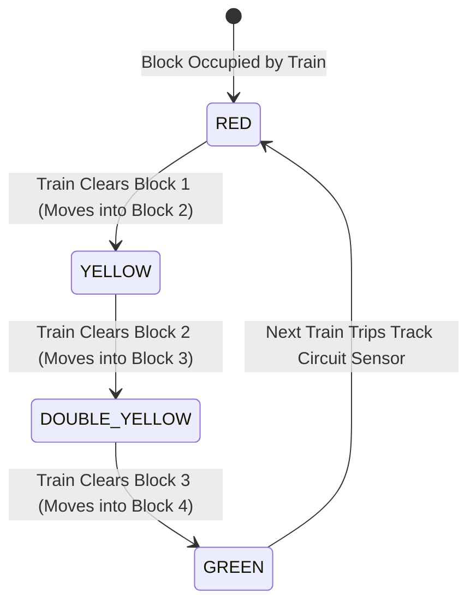
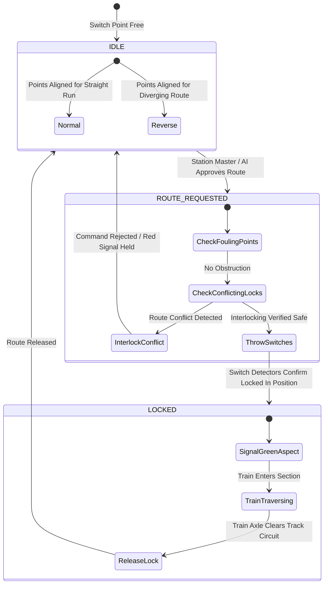
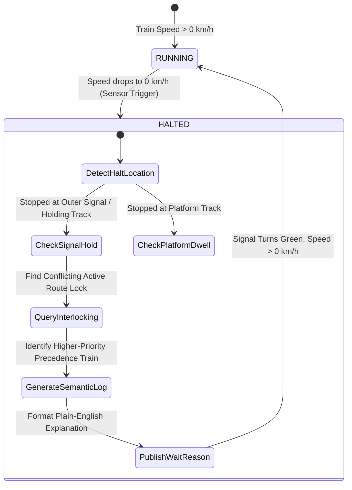

# Visual Representations, Topologies & State Machines (`docs/representation.md`)

This document provides visual diagrams, track topologies, state machines, and switch interlocking schematics for **Project Aahavaan - Rail**.

---

## 🛤️ 1. 6-Platform Junction with Outer Waiting Tracks Topology

```text
========================================================================================================================
                                     AAHAVAAN CENTRAL JUNCTION PHYSICAL TOPOLOGY
========================================================================================================================

   UP APPROACH                                 STATION THROAT                                   STATION EXIT
 (From Up Trunk)                                 (Switches)                                    (To Down Trunk)

                     +---------------------------------------+
                     | Outer Waiting Track 1 (Up Main Loop)  |
                     +---------------------------------------+
                    /                                         \
--- Up Main Track -+--[SW_01A]---------------------------------[SW_01B]--+
                    \                                                   /
                     +-------------------------------------------------+
                     | Outer Waiting Track 2 (Up Freight Siding)       |
                     +-------------------------------------------------+
                                       \
                                        \ (Crossover Ladder to Platforms)
                                         +==================== [ PLATFORM 1: 650m ] ====================+
                                         |                                                               |
                                         +==================== [ PLATFORM 2: 650m ] ====================+
                                         |                                                               |
                                         +==================== [ PLATFORM 3: 650m ] ====================+
                                         |                                                               |
                                         +==================== [ PLATFORM 4: 600m ] ====================+
                                         |                                                               |
                                         +==================== [ PLATFORM 5: 600m ] ====================+
                                         |                                                               |
                                         +==================== [ PLATFORM 6: 550m ] ====================+
                                         /
                     +-------------------------------------------------+
                     | Outer Waiting Track 3 (Down Freight Siding)     |
                     +-------------------------------------------------+
                    /                                                   \
--- Down Main ----+--[SW_02A]---------------------------------[SW_02B]--+
                    \                                         /
                     +---------------------------------------+
                     | Outer Waiting Track 4 (Down Main Loop)|
                     +---------------------------------------+

========================================================================================================================
 OPERATIONAL ZONES:
 1. Outer Waiting Siding 1 & 2: Buffers lower-priority trains before the Home Signal when station platforms are saturated.
 2. Station Platforms 1 - 6: Direct passenger embarkation/disembarkation with individual track circuits and starter signals.
 3. Station Throat Crossover: Interlocked ladder turnouts permitting any approach track to access any platform safely.
========================================================================================================================
```

---

## 🚦 2. Signal Aspect & Track Circuit State Machine



| Signal Aspect | Visual Display | Indication to Driver / Simulator | Speed Permitted |
| :--- | :--- | :--- | :--- |
| **RED** | Single Red Lamp | **Danger / Stop**. Do not pass signal. | $0\text{ km/h}$ |
| **YELLOW** | Single Amber Lamp | **Caution**. Expect next signal to be at Danger. | $30\text{ km/h}$ |
| **DOUBLE YELLOW** | Two Amber Lamps | **Attention**. Expect next signal at Caution. | $60\text{ km/h}$ |
| **GREEN** | Single Green Lamp | **Clear**. Line is clear for at least three blocks. | Max Permissible Speed ($110-160\text{ km/h}$) |

---

## 🔀 3. Switch Turnout & Route Interlocking FSM



---

## 💬 4. Passenger "Why is My Train Stopped?" Explainability FSM


