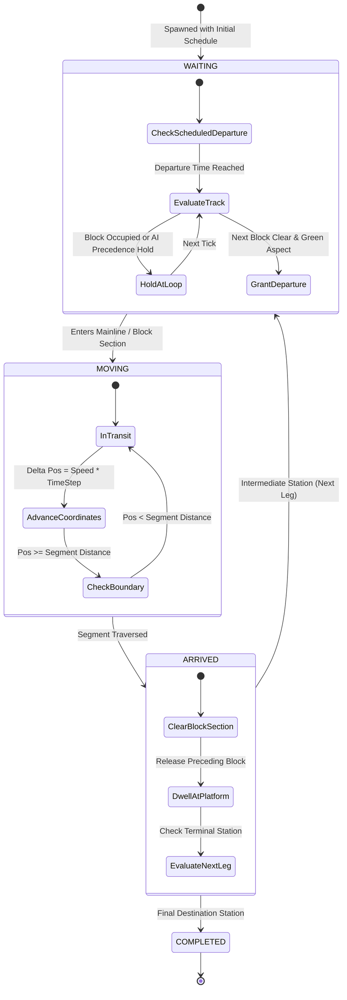
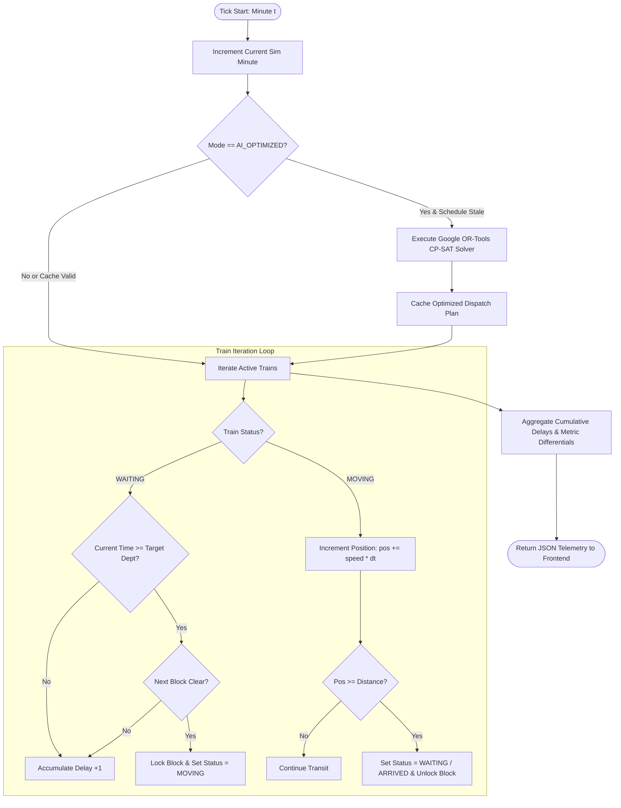

# Visual Representations & State Machines

This document provides detailed visual diagrams, state machines, and architectural representations of the **Project Aahavaan** simulation and dispatching engine.

---

## 🚦 1. Train Movement Finite State Machine (FSM)



---

## 🛤️ 2. Station Topology & Loop Line Overtaking Model

```text
========================================================================================
                              TYPICAL STATION TOPOLOGY (8 Stations)
========================================================================================

                         +-----------------------------+
                         |      Loop Line 1 (Siding)    |  <--- Freight Hold Track
                         +-----------------------------+
                        /                               \
--- Main Line Segment --+=========== Main Platform =====+--- Next Main Line Segment --->
                        \                               /
                         +-----------------------------+
                         |      Loop Line 2 (Siding)    |  <--- Dynamic Buffer Track
                         +-----------------------------+

========================================================================================
                             OVERTAKE SEQUENCE SCENARIO
========================================================================================

Step 1: Freight Train T_12315 arrives at Station C.
        AI detects Vande Bharat T_12301 approaching 15 km behind.
        Action -> Route T_12315 into Loop Line 1.

Step 2: Main Line clear. Vande Bharat T_12301 passes through Station C Main Line at 160 km/h.

Step 3: Vande Bharat enters Segment C-D. Signal turns green.
        Action -> Dispatch Freight T_12315 back to Main Line with minimal cumulative penalty.
========================================================================================
```

---

## 🔄 3. Simulation Step Sequence Flowchart



---

## 📊 4. Network Topological Map Representation

```text
[STN_00] ===(SEG_01: 15km)===> [STN_01] ===(SEG_12: 15km)===> [STN_02] ===(SEG_23: 15km)===> [STN_03]
 Station A                       Station B                       Station C                       Station D
 (1 Main, 2 Loops)               (1 Main, 2 Loops)               (1 Main, 2 Loops)               (1 Main, 2 Loops)
        |                               |                               |                               |
        v                               v                               v                               v
[STN_04] ===(SEG_45: 15km)===> [STN_05] ===(SEG_56: 15km)===> [STN_06] ===(SEG_67: 15km)===> [STN_07]
 Station E                       Station F                       Station G                       Station H
 (1 Main, 2 Loops)               (1 Main, 2 Loops)               (1 Main, 2 Loops)               (1 Main, 2 Loops)
```
