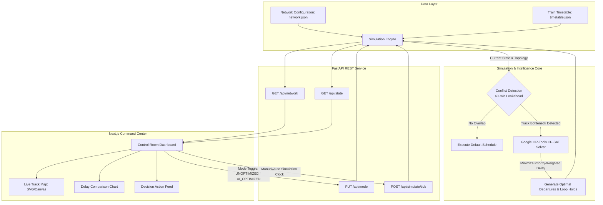
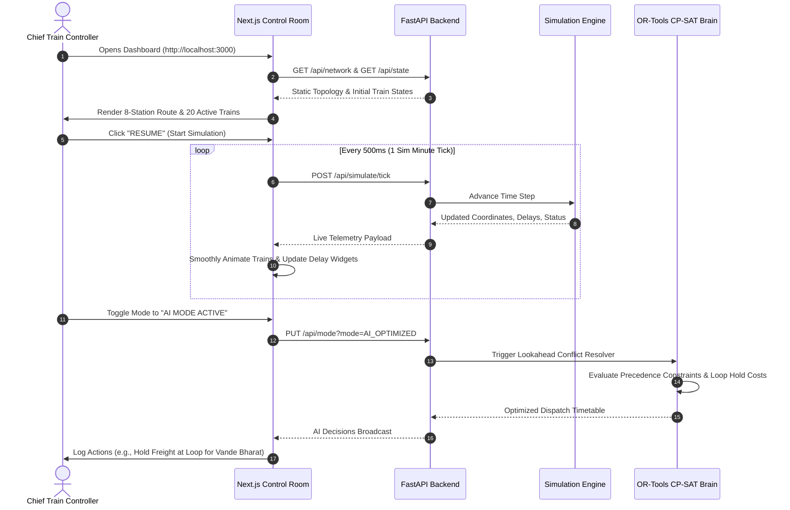
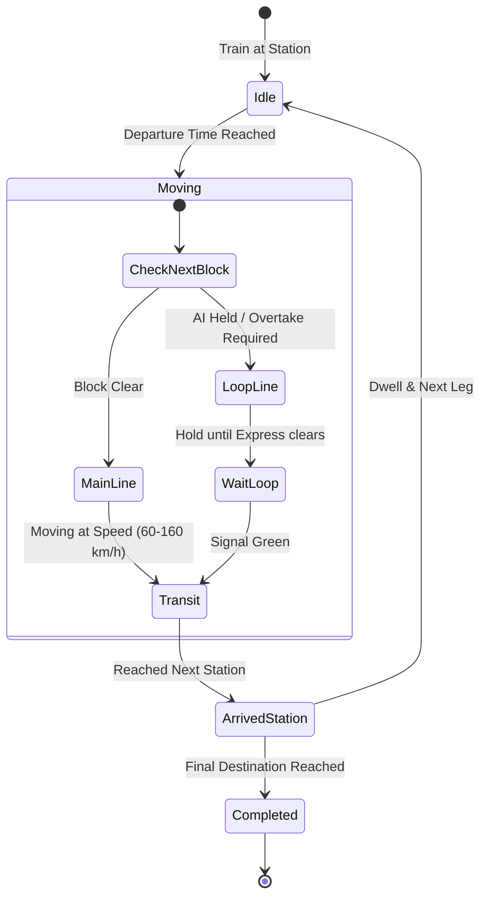

# System Workflow & User Journey

This document visualizes the end-to-end user journey and internal system workflows for **Project Aahavaan - Rail (Indian Railways Digital Twin)**.

---

## 1. End-to-End System Workflow

---

## 2. Dispatcher / Controller User Journey

---

## 3. Conflict Detection & Resolution Lifecycle

