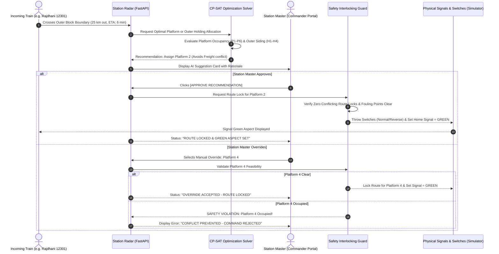
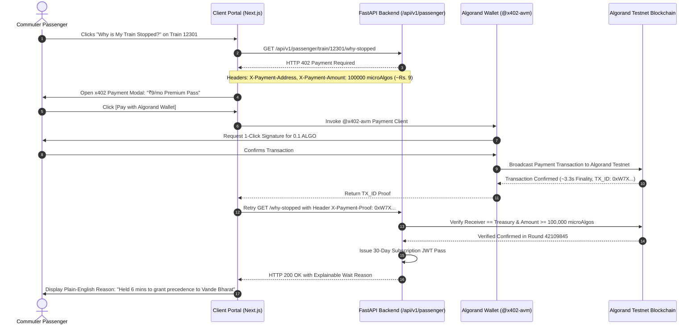

# System Workflows & Sequence Diagrams (`docs/workflow_chart.md`)

This document visualizes the complete end-to-end user journeys, system workflows, and protocol lifecycles across the **Phase 2** architecture of **Project Aahavaan - Rail**.

---

## 1. Multi-Frontend Ecosystem Architecture Flow

```mermaid
flowchart TD
    subgraph Data & AI Core [/models/]
        D1[(Raw IR Timetables)] --> ML[LightGBM Delay Predictor]
        D2[(Synthetic Stress Profiles)] --> ML
        ML -->|Dynamic ETAs| CPSAT[Google OR-Tools CP-SAT Solver]
        CPSAT -->|Ranked Platform & Outer Track Solution| BE
    end

    subgraph FastAPI Backend & Safety Core [/backend/]
        BE[FastAPI Event Engine] <--> STATEMGR[In-Memory Digital Twin State]
        BE <--> INTLOCK{Anti-Collision Interlocking Supervisor}
        INTLOCK -->|Validate Route Lock| SIG[Signal System & Point Switches]
        BE --> EXPLAIN[Wait-Log Reasoning Generator]
        BE <--> ALGO[Algorand Testnet & x402 Verifier]
    end

    subgraph Frontend 1: Station Simulator [/frontend/simulator/]
        BE ==WebSocket /ws/simulator==> SIM_UI[6-Platform Physical Canvas & Outer Holding Tracks]
    end

    subgraph Frontend 2: Station Commander [/frontend/station-commander/]
        BE ==WebSocket /ws/station-master==> CMD_UI[Incoming Radar & AI Suggestions]
        CMD_UI -->|HITL One-Click Approve / Override| BE
    end

    subgraph Frontend 3: Passenger Client Portal [/client/]
        CLIENT_UI[Train Search & Live Tracker] -->|GET /why-stopped| BE
        BE -->|HTTP 402 Payment Required| CLIENT_UI
        CLIENT_UI -->|Micro-Payment 0.1 ALGO| WALLET[Pera / Defly Wallet @x402-avm]
        WALLET -->|On-Chain TX| BLOCKCHAIN[(Algorand Testnet)]
        BLOCKCHAIN -->|Confirmed Round| ALGO
        CLIENT_UI -->|X-Payment-Proof| BE
        BE -->|Unlocked Explainable Wait Log| CLIENT_UI
    end
```

---

## 2. Station Master Human-in-the-Loop (HITL) Approval Sequence



---

## 3. Passenger x402 + Algorand Micropayment Subscription Lifecycle


